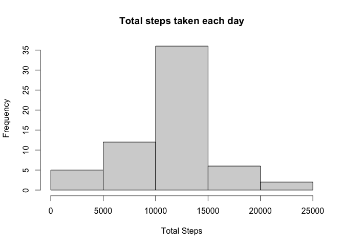

## Loading and preprocessing the data
first load the data

```r
data1<-read.csv("activity.csv", header = TRUE, sep = ",")
str(data1)
```

```
## 'data.frame':	17568 obs. of  3 variables:
##  $ steps   : int  NA NA NA NA NA NA NA NA NA NA ...
##  $ date    : chr  "2012-10-01" "2012-10-01" "2012-10-01" "2012-10-01" ...
##  $ interval: int  0 5 10 15 20 25 30 35 40 45 ...
```

see how many rows the data has

```r
nrow(data1)
```

```
## [1] 17568
```

## What is mean total number of steps taken per day?

```r
sumstep <- aggregate(data1$steps~data1$date,data= data1, FUN = sum)
colnames(sumstep)<- c("date", "steps")
```


Making a histogram for the total number of steps taken per day

```r
hist(sumstep$steps, main = "Total Steps taken each day", xlab="Number Steps")
```

<!-- -->

The mean total number of steps taken per day

```r
meanstep<- mean(sumstep$steps)
meanstep
```

```
## [1] 10766.19
```

```r
medianstep<-median(sumstep$steps)
medianstep
```

```
## [1] 10765
```


## What is the average daily activity pattern?
Make a time series plot of the 5-minute interval(x axis) and the average number of steps taken, averaged across all days (y-axis)


```r
meanstep_interval <- aggregate(data1$steps~data1$interval, data=data1, mean)
```

Assigning name to the new data frame containing average steps by time interval

```r
colnames(meanstep_interval)<-c("interval", "steps")
```

Plot graph showing average steps across different interval (X axis)

```r
plot(meanstep_interval$interval, meanstep_interval$steps, type="l",xlab="Interval", ylab="Steps", main= "Average Daily Activity Pattern ")
```

<!-- -->

Which 5 minute time interval contains the most step


```r
max_step<-max(meanstep_interval$steps)
max_interval<-meanstep_interval$interval[meanstep_interval$steps == max_step]
max_interval
```

```
## [1] 835
```
The 5 minute interval where there is max of average steps taken is 835

## Imputing missing values
Calculate the number of row with NA values

```r
totalNA<-sum(is.na(data1$steps))
totalNA
```

```
## [1] 2304
```
Replacing NA value with mean value for that same interval (meanstep_interval)
first make a new data so we can retrace our mistakes if needed

```r
data2<-data1
```
Now replacing the NA value with mean steps for each time interval

```r
NAlocation<-which(is.na(data2$steps))
for (i in NAlocation) {
    data2$steps[i]<-with(meanstep_interval, steps[interval ==data2$interval[i]])
}
```
Now test if we replace all NA or not

```r
sum(is.na(data2))
```

```
## [1] 0
```
Making histogram of total steps taken per day. Report mean and median
First we calculate the total of steps taken by day

```r
sumstep2<-aggregate(data2$steps~data2$date, data=data2, sum)
colnames(sumstep2)<- c("date", "steps")
```
Plug in a histogram


```r
hist(sumstep2$steps,xlab = "Total Steps", main = "Total steps taken each day")
```

<!-- -->

The mean and mediantotal number of steps taken per day


```r
meanstep2<- mean(sumstep2$steps)
meanstep2
```

```
## [1] 10766.19
```

```r
medianstep2<-median(sumstep2$steps)
medianstep2
```

```
## [1] 10766.19
```

To compared with the mean and median values from the old data
We make a new data frame

```r
compare<-data.frame(meancol=c(meanstep, meanstep2), mediancol=c(medianstep, medianstep2))
compare
```

```
##    meancol mediancol
## 1 10766.19  10765.00
## 2 10766.19  10766.19
```
From the table, we see that after we fill all the NA value with the average step takens per interval, we have the same mean and median values


## Are there differences in activity patterns between weekdays and weekends?

First create new factor variable, with two level "weekday" or "weekend" based on the date column in data

First denote what is weekdays / not weekend

```r
weekday<-c("Monday", "Tuesday", "Wednesday", "Thursday", 
              "Friday")
```

Use ifelse to check if the date is in weekday. If not weekend


```r
wk1<-weekdays(as.Date(data2$date))
wk<-ifelse(wk1 %in% weekday, "weekday", "weekend")
data3<-cbind(data2,wk)
```


Make a plot of the 5-minute interval (x-axis) and the mean number of steps taken, averaged across all weekday days or weekend (factor)


```r
meanstepweekday<-aggregate(data3$steps, by=list(data3$interval, data3$wk),mean)
colnames(meanstepweekday)<-c("interval","wk","steps")
```

Now make the plot


```r
library(ggplot2)
g<-ggplot(meanstepweekday, aes(x=interval, y=steps))+
  geom_line()+
  facet_grid(wk~.)+    #divide graph by factor variable
  xlab("Interval")+ylab("Number of steps")+ #x y axis name
  ggtitle("Average steps taken across 5 minute time intervals") #title
g
```

<!-- -->


